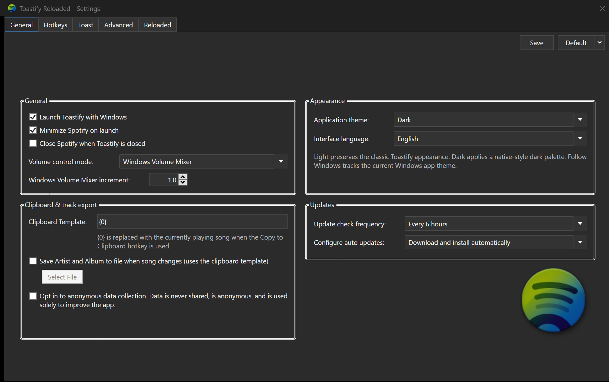
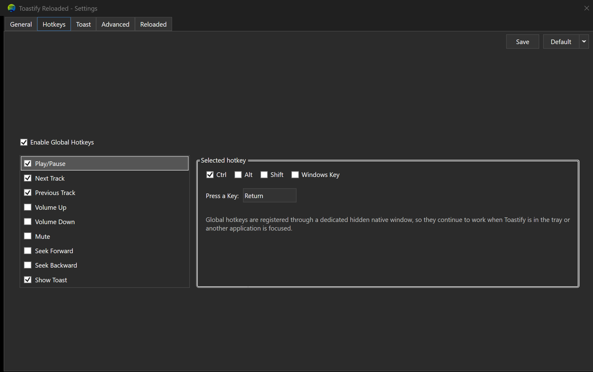
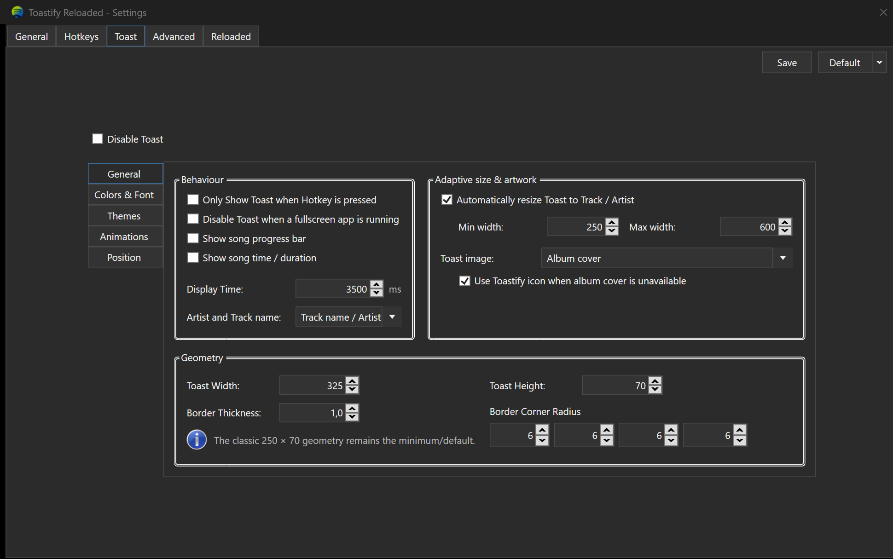
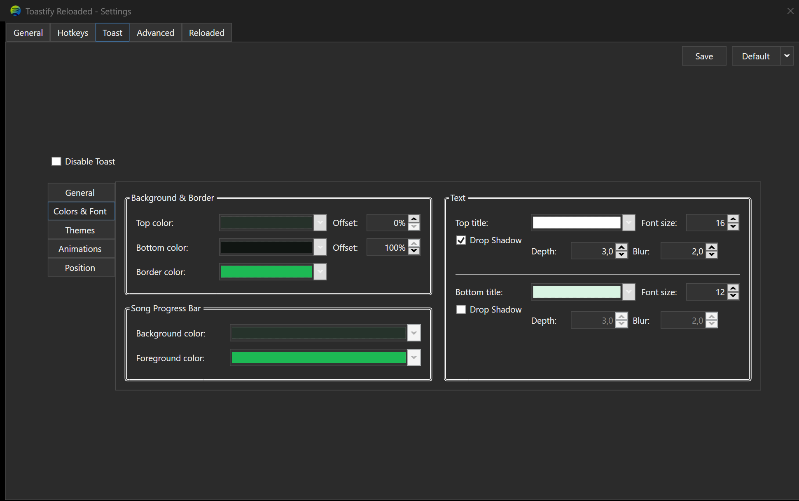
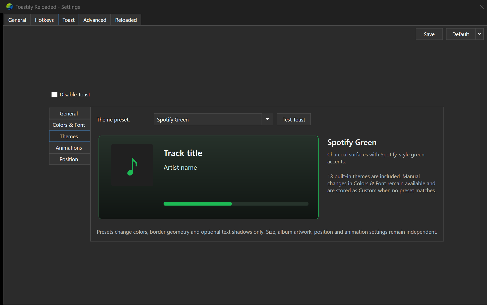
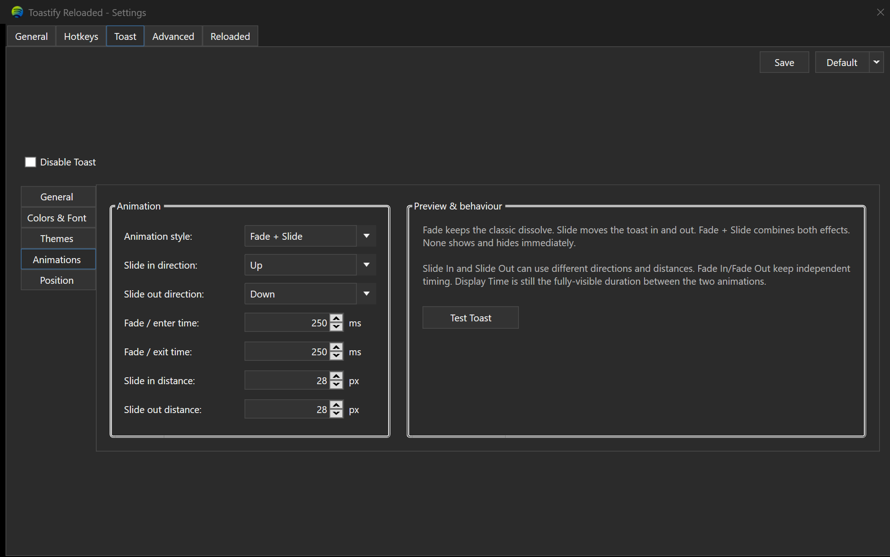
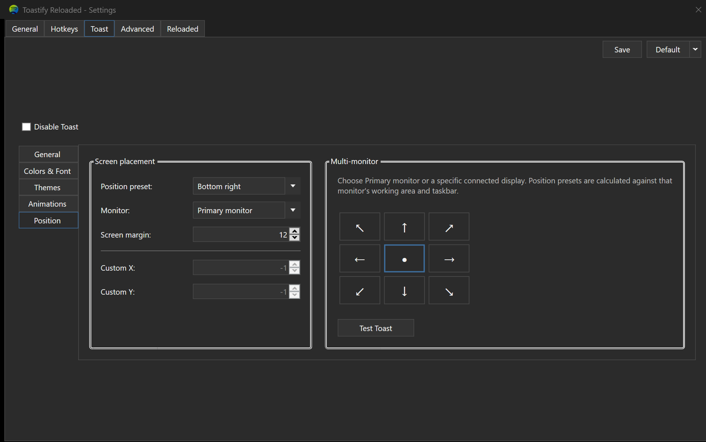
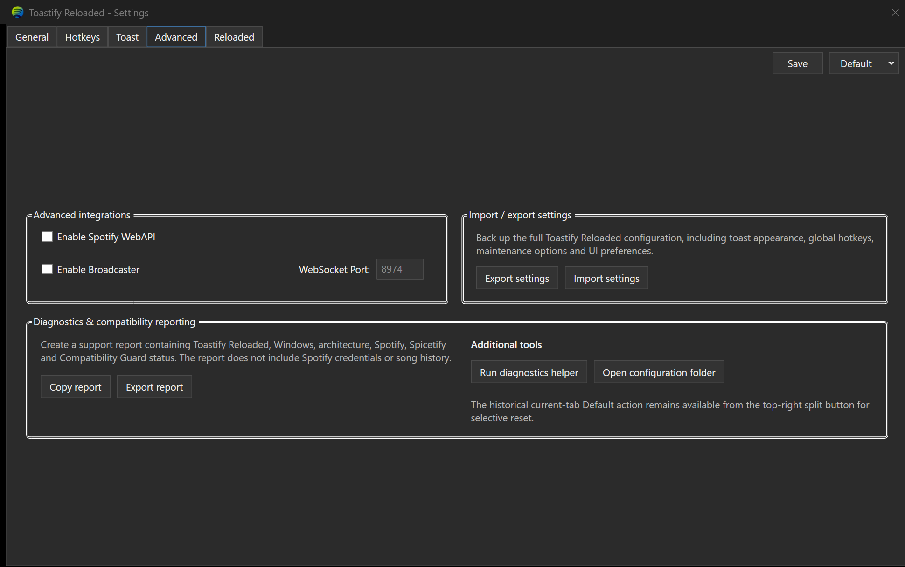
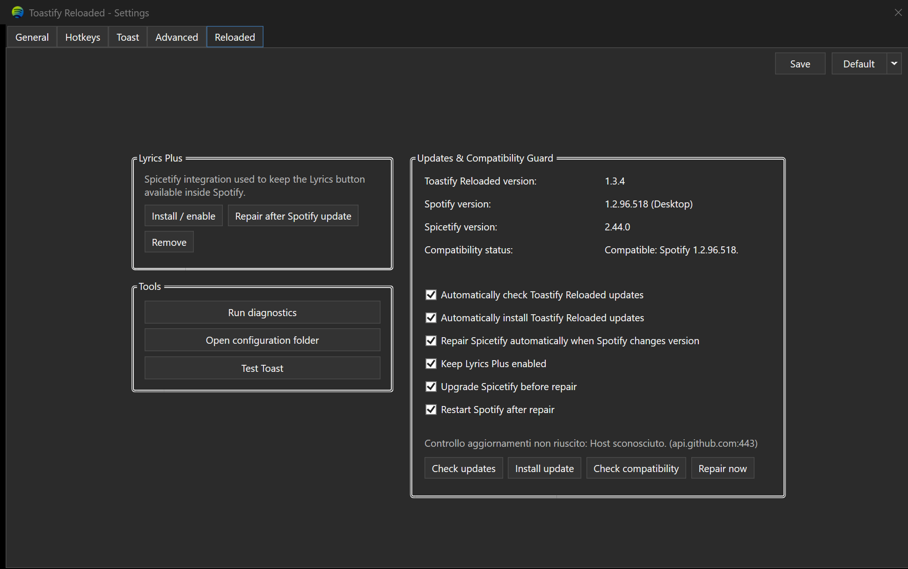
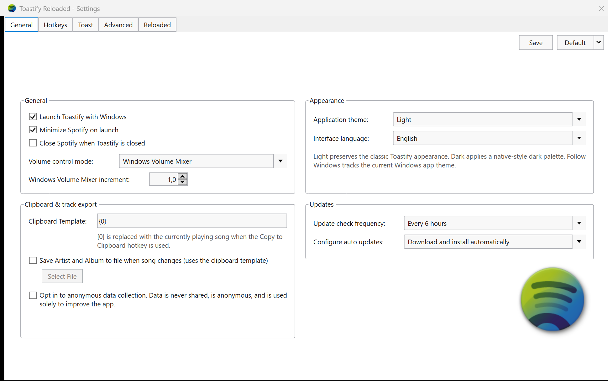

# Toastify Reloaded

<p align="center">
  <strong>Classic Toastify experience. Modern Spotify compatibility.</strong>
</p>

<p align="center">
  <a href="https://github.com/Marlius92/Toastify-Reloaded/actions/workflows/build.yml">
    
  </a>
  <a href="https://github.com/Marlius92/Toastify-Reloaded/releases/latest">
    
  </a>
  <a href="LICENSE">
    
  </a>
  
  
  
</p>

**Toastify Reloaded** is a modern continuation of the classic Toastify experience for Spotify on Windows, with a native Linux port now available in preview.

The project keeps the recognizable Toastify workflow and notification style while replacing obsolete integration points with modern Windows media controls, global hotkeys, Spicetify/Lyrics support, automatic repair after Spotify updates, installable Windows releases, dark mode, toast themes, adaptive song timeline controls, animations and multi-monitor positioning.

> **Independent community project.** Toastify Reloaded is not affiliated with Spotify AB and is not an official release maintained by the original Toastify developers.

**Current stable Windows release:** `v1.3.4`  
**Current Linux preview:** `v1.4.0-linux-preview.3`


---

## Download

### Windows — stable

[Download Toastify Reloaded from GitHub Releases](https://github.com/Marlius92/Toastify-Reloaded/releases)

Windows installer packages:

- **Windows x64** — `ToastifyReloaded-Setup-win-x64.exe`
- **Windows ARM64** — `ToastifyReloaded-Setup-win-arm64.exe`

Current stable Windows release: **v1.3.4**.

### Linux — Preview 3

The Linux port is progressing rapidly toward feature parity with the Windows v1.3.4 release.

Current Linux preview tag:

```text
v1.4.0-linux-preview.3
```

Linux packages:

**x64**

- `ToastifyReloaded-Linux-x64.AppImage`
- `toastify-reloaded_1.4.0~preview3_amd64.deb`
- `ToastifyReloaded-Linux-x64.tar.gz`

**ARM64**

- `toastify-reloaded_1.4.0~preview3_arm64.deb`
- `ToastifyReloaded-Linux-arm64.tar.gz`

Both architectures are built automatically through GitHub Actions. The x64 build also passes an automated GUI startup smoke test on Ubuntu 24.04.

> Preview 3 is the current validated baseline. A short parity pass remains before the first stable Linux release.

Fast-track Linux roadmap:

```text
v1.4.0-linux-preview.4   Feature-parity pass
v1.4.0-linux-rc.1        Release candidate / updater / final validation
v1.4.0-linux             Stable
```

---

# Application screenshots

These screenshots are captured directly from **Toastify Reloaded v1.3.4** running on Windows.

They show the real application interface rather than promotional mockups.

### Main settings

| General | Hotkeys |
|---|---|
|  |  |

### Toast settings

| General | Colors & Font |
|---|---|
|  |  |

| Themes | Animations |
|---|---|
|  |  |

| Position | Advanced |
|---|---|
|  |  |

### Reloaded & Light Theme

| Reloaded | Light Theme |
|---|---|
|  |  |

### Toast notification

<p align="center">
  
</p>

---

# What's new in v1.3.4

Version **1.3.4** refines the enlarged Settings interface introduced in the previous releases.

### Wider, shorter Settings window

The fixed Settings shell is now:

```text
1120 × 700
```

Compared with the v1.3.3 `1000 × 760` shell, this revision uses more horizontal space and less vertical space.

The result is a more balanced desktop layout, especially on the Toast pages where translated labels and numeric controls need additional width.

### Better spacing for adaptive toast controls

The **Toast → General → Adaptive size & artwork** section now gives dedicated room to:

- minimum toast width;
- maximum toast width;
- localized labels such as **Larghezza min** and **Larghezza max**;
- the corresponding numeric controls;
- a slightly wider Adaptive size & artwork panel than the Behaviour panel.

This prevents the maximum-width label from sitting directly against the `600` field in the Italian interface.

### No return of page scrollbars

The application remains a fixed-layout desktop UI. The v1.3.4 geometry is designed to keep the main settings pages fully visible without depending on user-facing scrollbars.

---

# What's new in v1.3.3

Version **1.3.3** focuses on readability, localization and layout stability across the enlarged Reloaded interface.

### Larger Settings window

The fixed Settings window was expanded in v1.3.3 to:

```text
1000 × 760
```

It is refined again in **v1.3.4** to a wider and shorter `1120 × 700` layout.

This provides additional horizontal and vertical room for the growing Toastify Reloaded feature set without bringing back unnecessary scrollbars.

The larger layout specifically improves:

- **Toast → General**
- **Toast → Colors & Font**
- **Toast → Themes**
- **Toast → Animations**
- **Toast → Position**
- **Advanced**
- **Reloaded**

Controls such as minimum / maximum toast width, border-radius fields, color pickers and advanced diagnostics no longer need to be compressed into the historical 580-pixel-wide layout.

### Full English / Italian localization

Localization now applies to substantially more than the top-level tab names.

The selected interface language is applied to:

- top-level tabs;
- Toast sub-tabs;
- group-box titles;
- buttons;
- check boxes;
- labels;
- explanatory text;
- animation settings;
- positioning controls;
- import / export settings;
- diagnostics and compatibility text;
- Reloaded maintenance controls;
- tray-related labels where supported.

The language infrastructure remains designed so additional interface languages can be added later.

### Selected-tab readability

The Light and Dark application themes now explicitly style the active tab state.

This fixes cases where a selected tab used a light background together with a light foreground, making labels such as **Advanced**, **Colors & Font** or other selected tabs difficult or impossible to read.

The active tab now remains readable in both:

- **Light**
- **Dark**

### Layout validation

The historical-UI verification checks were updated for the enlarged v1.3.3 shell and localization layer, while still protecting the recognizable Toastify tab structure and toast geometry.

---

# What's new in v1.3.2

Version **1.3.2** refines the v1.3 customization system and simplifies how toast settings are applied.

### Theme preset workflow

- The separate **Apply preset** button has been removed.
- Selecting a built-in toast preset immediately loads its values into the existing color controls.
- You can still modify every loaded value manually.
- **Save** is now the single action used to persist settings.
- Successful saves are silent; the old confirmation popup is no longer shown.
- Error messages are still shown when something genuinely needs attention.

### Optional song timeline

The toast timeline is now fully optional and split into independent controls:

- **Show song progress bar**
- **Show song time / duration**

The time display uses the familiar format:

```text
1:26 / 3:20
```

The progress bar now follows the real playback timeline while the toast is visible.

You can enable:

- only the progress bar;
- only current time / total duration;
- both;
- neither.

### Independent Slide In / Slide Out

Slide animation entry and exit behavior can now be configured separately.

Available directions:

- Up
- Down
- Left
- Right

You can independently configure:

- **Slide In direction**
- **Slide Out direction**
- **Slide In distance**
- **Slide Out distance**
- Enter / Fade In duration
- Exit / Fade Out duration

Example:

```text
Animation: Fade + Slide
Slide In:  Up      / 28 px
Slide Out: Right   / 60 px
Enter: 250 ms
Exit:  250 ms
```

This allows the toast to enter from one side and leave in a completely different direction.

---

# v1.3.1 — Dark theme correction

Version **1.3.1** corrected the first v1.3.0 Dark application theme implementation.

The dark palette is now applied consistently to:

- main window surfaces;
- tabs and tab contents;
- group boxes;
- text boxes;
- combo boxes and their dropdowns;
- list controls;
- borders;
- disabled states;
- selection states;
- supported title-bar surfaces.

The historical **Light** theme remains available and independent from the Dark theme.

---

# What's new in v1.3.0

Version **1.3.0** is the largest Reloaded UI and customization update so far.

### Application interface

- Larger fixed Settings window to prevent crowded controls and unnecessary scrollbars; expanded further to **1000 × 760** in v1.3.3.
- **Light** application theme.
- **Dark** application theme.
- **Follow Windows** theme mode.
- Dark title-bar integration where supported by Windows.
- DPI-safe layouts.
- English and Italian localization infrastructure, expanded to much broader interface coverage in v1.3.3.

### Toast customization

- Built-in colored theme presets.
- Manual color customization remains available.
- Album artwork support.
- Toastify Reloaded icon fallback when album artwork is unavailable.
- Optional image-free toast.
- Automatic toast width based on title and artist length.
- Configurable minimum and maximum toast width.
- Fade In and Fade Out timing.
- Slide animations.
- Fade + Slide animations.
- Animation direction and distance settings.
- Position presets.
- Multi-monitor selection.
- Custom screen coordinates.

### Settings & diagnostics

- Import settings from JSON.
- Export settings to JSON.
- Advanced compatibility diagnostics.
- Copy/export diagnostic reports.
- Compatibility Guard status reporting.

---

# Linux Preview — v1.4.0-linux-preview.3

The Linux port is maintained separately from the existing Windows/WPF application and is built with **Avalonia**.

Spotify playback and metadata use the Linux **MPRIS** interface through `playerctl`.

## Preview 3 feature set

Linux Preview 3 includes:

- Play / Pause, Previous and Next;
- Seek ±10 seconds;
- Spotify volume and mute controls;
- automatic Spotify/MPRIS player detection and reconnection;
- support for standard Spotify MPRIS names and `spotifyd`;
- automatic toast on track change;
- album artwork and Toastify icon fallback;
- adaptive toast width;
- optional progress bar and song time / duration;
- Fade, Slide and Fade + Slide animations;
- independent Slide In / Slide Out directions and distances;
- built-in Toastify Reloaded toast themes;
- Light, Dark and Follow System application themes;
- Linux autostart;
- system tray controls;
- optional close-to-tray behavior;
- runtime Italian / English localization;
- JSON settings import / export;
- Spicetify and Lyrics Plus helpers;
- Linux Compatibility Guard;
- automatic Spicetify repair after a detected Spotify update;
- Linux release update checks;
- X11 global hotkeys through `xbindkeys`;
- Wayland global hotkeys through **XDG Global Shortcuts Portal**;
- Avalonia native Wayland backend when available;
- Linux diagnostics;
- x64 and ARM64 packages.

## X11 and Wayland

Toastify Reloaded automatically selects the appropriate shortcut backend:

- **X11:** `xbindkeys`
- **Wayland:** `org.freedesktop.portal.GlobalShortcuts`

On Wayland, the desktop environment can display a permission or shortcut configuration dialog when global shortcuts are registered for the first time.

## Compatibility Guard

The Linux Compatibility Guard records the detected Spotify version and can react when Spotify changes.

When automatic repair is enabled, Toastify Reloaded can run the Spicetify recovery sequence and preserve Lyrics Plus where possible.

The guard also prevents endlessly retrying the same failed Spotify-version repair.

## System tray

The Linux build includes tray actions for:

- Open settings;
- Play / Pause;
- Next;
- Previous;
- Exit.

Tray support depends on the desktop environment's StatusNotifierItem/AppIndicator support. For this reason, **close-to-tray is disabled by default**.

## Import / Export

Linux settings are stored under:

```text
~/.config/toastify-reloaded/settings.json
```

Settings can also be exported and imported as JSON from the application.

## Linux packages

### x64

```text
ToastifyReloaded-Linux-x64.AppImage
toastify-reloaded_1.4.0~preview3_amd64.deb
ToastifyReloaded-Linux-x64.tar.gz
```

### ARM64

```text
toastify-reloaded_1.4.0~preview3_arm64.deb
ToastifyReloaded-Linux-arm64.tar.gz
```

The ARM64 build is cross-published using the `.NET` `linux-arm64` runtime identifier and validated for architecture and package metadata by GitHub Actions.

## GitHub Actions validation

The Linux CI currently validates:

```text
x64 restore/build
→ Avalonia GUI startup under virtual X11
→ x64 tar.gz
→ x64 .deb
→ x64 AppImage
→ x64 package validation
→ ARM64 cross-build
→ ARM64 ELF architecture validation
→ ARM64 tar.gz
→ ARM64 .deb metadata validation
→ artifact upload
```

## Fast-track parity status

Preview 3 is the current validated Linux baseline, but it is **not yet being described as full Windows v1.3.4 parity**.

The remaining parity work is intentionally concentrated into a short final sequence.

### Preview 4 — parity pass

The next preview focuses on the remaining user-facing Windows features that have meaningful Linux equivalents:

- full **Toast → Colors & Font** customization;
- toast geometry: fixed width / height, border thickness and corner radius;
- title ordering;
- title colors, font sizes and optional text shadows;
- progress-bar colors;
- **Toast → Position** with the nine position presets;
- monitor selection and custom X/Y coordinates;
- screen margin;
- `Only show toast when hotkey is pressed`;
- fullscreen-toast suppression where the Linux display server exposes enough information;
- Show Toast global hotkey;
- configurable MPRIS volume step;
- current-track file export;
- Start Minimized;
- optional Close Spotify with Toastify;
- closer settings parity with the Windows interface.

### RC 1 — release behavior

Once Preview 4 is green, the release candidate is limited to:

- Linux self-update / install flow;
- final Compatibility Guard parity;
- update/restart behavior;
- package installation tests;
- AppImage tests;
- `.deb` tests;
- x64 / ARM64 release checks;
- regression fixes only.

### Stable

If RC 1 passes the complete GitHub Actions release gate, the target stable tag is:

```text
v1.4.0-linux
```

Platform-specific Windows-only behavior that cannot be reproduced safely on a Linux desktop or under Wayland will be documented explicitly rather than emulated unreliably.

For Linux-specific build details see:

```text
docs/LINUX.md
```

---

# Windows / Linux parity target

The Linux port aims to reproduce the **functional** feature set of Windows v1.3.4 while using native Linux mechanisms where Windows APIs do not exist.

| Area | Windows v1.3.4 | Linux Preview 3 | Target |
|---|---:|---:|---:|
| Spotify playback / metadata | ✅ | ✅ | ✅ |
| Global hotkeys | ✅ | ✅ X11 / Wayland Portal | ✅ |
| Album artwork / fallback | ✅ | ✅ | ✅ |
| Adaptive toast width | ✅ | ✅ | ✅ |
| Progress / song duration | ✅ | ✅ | ✅ |
| Theme presets | ✅ | ✅ | ✅ |
| Fade / Slide animations | ✅ | ✅ | ✅ |
| App Light / Dark / System | ✅ | ✅ | ✅ |
| IT / EN localization | ✅ | ✅ | ✅ |
| Import / Export | ✅ | ✅ | ✅ |
| System tray | ✅ | ✅ | ✅ |
| Compatibility Guard | ✅ | ✅ core | RC 1 |
| Linux/Windows auto update | ✅ | Check-only on Linux | RC 1 |
| Custom Colors & Font | ✅ | ⏳ | Preview 4 |
| Fixed toast geometry | ✅ | ⏳ | Preview 4 |
| Position presets | ✅ | ⏳ | Preview 4 |
| Multi-monitor selection | ✅ | ⏳ | Preview 4 |
| Custom X / Y position | ✅ | ⏳ | Preview 4 |
| Show-Toast hotkey | ✅ | ⏳ | Preview 4 |
| Track file export | ✅ | ⏳ | Preview 4 |

The stable Linux release will be cut only after the parity items above are completed or explicitly documented as platform-specific limitations.

---

# Main features

## Global hotkeys

Hotkeys are registered independently from the visible Settings window and continue to work while another program is focused or Toastify Reloaded is hidden in the system tray.

Default shortcuts:

| Action | Shortcut |
|---|---|
| Play / Pause | `Ctrl+Alt+Space` |
| Next track | `Ctrl+Alt+Right` |
| Previous track | `Ctrl+Alt+Left` |
| Volume up | `Ctrl+Alt+Up` |
| Volume down | `Ctrl+Alt+Down` |
| Mute | `Ctrl+Alt+M` |
| Seek +10 seconds | `Ctrl+Alt+Shift+Right` |
| Seek -10 seconds | `Ctrl+Alt+Shift+Left` |
| Show toast | `Ctrl+Alt+T` |

All hotkeys can be customized.

> Windows-reserved combinations or combinations already registered by another application may not be available.

---

## Classic toast, modernized

The classic Toastify notification remains the basis of the popup.

The default minimum geometry stays close to the historical Toastify layout, while Reloaded can now adapt it dynamically to modern metadata and displays.

### Album artwork

The toast can display:

- **Album cover**
- **Toastify Reloaded icon**
- **No image**

When **Album cover** is selected, Toastify Reloaded reads the thumbnail provided by the current Windows media session. If Spotify does not expose artwork, the Toastify icon can be used automatically as fallback.

### Adaptive width

The toast can automatically grow to fit long song titles and artist names.

Example defaults:

```text
Minimum width: 250 px
Maximum width: 600 px
```

If automatic resizing is disabled, the manual Toast Width setting is used instead.

---

### Optional song timeline

The playback timeline is independently configurable.

```text
Show song progress bar:     On / Off
Show song time / duration:  On / Off
```

When enabled, song time is displayed as:

```text
current time / total duration
1:26 / 3:20
```

The progress bar uses the current Windows media-session timeline and updates while the toast is visible.


# Toast themes

Toastify Reloaded v1.3.0 includes **13 built-in presets plus Custom**.

| Theme | Style |
|---|---|
| **Classic Toastify** | Historical gray-to-black Toastify look |
| **Spotify Green** | Dark background with Spotify-style green accents |
| **Midnight Blue** | Deep navy and cool blue |
| **Neon Purple** | Dark background with vivid purple |
| **Cyberpunk** | Blue / purple / hot-pink contrast |
| **Crimson Night** | Black and crimson red |
| **Amber Gold** | Warm dark tones with gold accents |
| **Emerald** | Dark green and emerald |
| **Ocean** | Deep blue and turquoise |
| **Sakura** | Dark violet and soft pink |
| **Arctic** | Cool gray and ice blue |
| **Monochrome** | Black, white and neutral gray |
| **Retro Synthwave** | Purple, magenta and warm neon accents |
| **Custom** | Full manual control |

**Classic Toastify remains the default preset.**

Theme presets affect the visual palette of the toast without removing the existing manual color controls.

In **v1.3.2**, there is no separate Apply button:

```text
Select preset
    ↓
Preset values load into the normal controls
    ↓
Optional manual adjustments
    ↓
Save
```

`Save` is the single persistence action and no success-confirmation popup is shown.

---

# Toast animations

Available animation modes:

- **Fade**
- **Slide**
- **Fade + Slide**
- **None**

### Fade timing

You can configure entry and exit timing independently.

A value of `0 ms` can be used where applicable to disable a fade phase.

### Slide In / Slide Out

Starting with **v1.3.2**, entry and exit slide motion are independent.

Available directions:

- **Up**
- **Down**
- **Left**
- **Right**

Independent controls:

```text
Slide In direction
Slide Out direction
Slide In distance
Slide Out distance
Fade / Enter time
Fade / Exit time
Display time
```

This allows combinations such as:

```text
Enter from Left
Exit toward Down
```

or:

```text
Enter from Bottom
Exit toward Right
```

Legacy animation settings from earlier v1.3 builds are retained as fallback values when migrating an existing configuration.

---

# Positioning & multi-monitor

Toastify Reloaded supports position presets including:

```text
Top Left       Top Center       Top Right
Middle Left    Center           Middle Right
Bottom Left    Bottom Center    Bottom Right
Custom
```

You can also select the target monitor and configure custom offsets / screen coordinates.

This is useful for multi-monitor desktops, gaming setups and secondary displays.

---

# Application themes

The **application theme** is separate from the **toast theme**.

For example:

```text
Application theme: Dark
Toast theme: Sakura
```

or:

```text
Application theme: Light
Toast theme: Classic Toastify
```

Available application modes:

- **Follow Windows**
- **Light**
- **Dark**

This keeps the historical Toastify appearance available while allowing a modern dark interface.

The current v1.3.4 Settings shell uses a fixed **1120 × 700** layout to provide more horizontal room while reducing the vertical footprint in both Light and Dark themes.

---

# Interface localization

Toastify Reloaded currently includes:

- **English**
- **Italiano**

Starting with **v1.3.3**, localization covers the main static interface rather than only the top-level navigation labels.

Changing the language updates the text used throughout the Settings interface while leaving saved toast colors, hotkeys, themes and playback behavior unchanged.

The localization service is structured so more languages can be added without redesigning the application.

---

# Lyrics Plus

Toastify Reloaded integrates with **Spicetify Lyrics Plus**.

The Reloaded tools can:

- enable Lyrics Plus;
- restore it after Spotify updates;
- remove it;
- preserve it automatically during Compatibility Guard repairs.

Toastify Reloaded does **not** bundle or redistribute song lyrics.

---

# Compatibility Guard

Spotify updates can overwrite Spicetify modifications. Compatibility Guard is designed to detect that change and repair the customization automatically.

When a new Spotify version is detected, Toastify Reloaded can:

1. detect the Spotify version change;
2. close Spotify;
3. optionally update Spicetify;
4. run `spicetify backup apply`;
5. fall back to `spicetify restore backup apply` when needed;
6. ensure Lyrics Plus remains enabled;
7. apply the customization;
8. restart Spotify;
9. remember the successfully repaired Spotify version.

If a brand-new Spotify build is temporarily unsupported by Spicetify, Reloaded avoids repeatedly entering an endless repair loop for the same version.

---

# Automatic updates

Toastify Reloaded can check GitHub Releases for newer versions.

Installed builds use the Windows installer update path, preserving the user's configuration in:

```text
%APPDATA%\ToastifyReloaded\
```

Update behavior can be configured from the Reloaded settings.

---

# Saving settings

Toastify Reloaded uses the main **Save** button as the single persistence action for interface, toast, theme, animation and other settings.

Starting with **v1.3.2**:

- there is no separate **Apply preset** action;
- successful saves do not display a confirmation popup;
- genuine validation or hotkey-registration errors can still display a warning.

---

# Import / export settings

Toastify Reloaded v1.3.0 can export the current configuration to JSON and import it again later.

This is useful for:

- backups;
- moving settings to another PC;
- experimenting with themes;
- restoring hotkey configurations.

---

# Diagnostics

Diagnostic information can include:

- Toastify Reloaded version;
- Windows version;
- display / DPI information;
- monitor information;
- Spotify version;
- Spicetify version;
- Compatibility Guard state;
- active application theme;
- active toast theme;
- animation configuration;
- maintenance settings.

Reports can be copied or exported for troubleshooting.

---

# Privacy

Toastify Reloaded does **not** require:

- your Spotify password;
- your Spotify username;
- a Spotify developer Client ID;
- a Spotify developer Client Secret.

Playback information is obtained from Windows media sessions.

User settings are stored locally.

Network access is mainly used for update checks and components such as Spicetify that require online access.

---

# Compatibility

| Component | Status |
|---|---|
| Windows 11 x64 | Supported |
| Windows 10 x64 | Supported |
| Windows ARM64 | Installer/build available |
| Spotify desktop client | Supported |
| Global hotkeys | Supported |
| Multiple monitors | Supported |
| Light interface | Supported |
| Dark interface | Supported |
| Follow Windows theme | Supported |
| English interface | Supported |
| Italian interface | Supported |
| Wide 1120×700 Settings UI | Supported |
| Spicetify / Lyrics Plus | Supported when compatible with the installed Spotify build |

Very new Spotify versions may temporarily require a newer Spicetify release before injected UI modifications can be restored.

---

# Project lineage & credits

Toastify Reloaded exists because of the developers who created and maintained Toastify before this project.

Special credit goes to:

- **[nachmore](https://github.com/nachmore)** — creator / maintainer of the original GitHub Toastify project: [nachmore/toastify](https://github.com/nachmore/toastify)
- **Alessandro Attard Barbini — [@aleab](https://github.com/aleab)** — maintainer of the later Toastify fork and the historical **1.11.x** generation used as a major visual and behavioral reference: [aleab/toastify](https://github.com/aleab/toastify)
- **[Marlius92](https://github.com/Marlius92)** — Toastify Reloaded development and maintenance.

The original authors are **not responsible for Toastify Reloaded**, its new code, support, releases, compatibility changes or future development.

## Project philosophy

Toastify Reloaded is not intended to erase or redesign Toastify.

Its goal is to keep the classic application recognizable while replacing obsolete or broken integrations with implementations that work with current Windows and Spotify versions.

> **Classic Toastify experience. Modern Spotify compatibility.**

---

# Completed roadmap

## Completed before / through v1.3.4

- [x] Historical Toastify-style interface
- [x] Global hotkeys independent of the focused window
- [x] Fade In / Fade Out controls
- [x] Adaptive toast width
- [x] Spotify album artwork in toast
- [x] Toastify icon fallback
- [x] Windows installer
- [x] Automatic Toastify Reloaded updates
- [x] Compatibility Guard
- [x] Automatic Spicetify recovery after Spotify updates
- [x] Lyrics Plus integration
- [x] Built-in colored toast theme presets
- [x] Additional toast animation styles
- [x] Position presets
- [x] Multi-monitor support
- [x] Import / export Toastify Reloaded settings
- [x] Localization infrastructure
- [x] English and Italian interface support
- [x] Additional diagnostics and compatibility reporting
- [x] Automated historical-UI regression checks
- [x] Light / Dark / Follow Windows application themes
- [x] Complete Dark-theme surface/control rendering fix
- [x] Silent Save workflow without success popup
- [x] Theme preset selection without separate Apply action
- [x] Optional song time / duration display
- [x] Live song progress-bar timeline
- [x] Independent Slide In / Slide Out directions
- [x] Independent Slide In / Slide Out distances
- [x] Enlarged 1000×760 Settings window
- [x] Broader full-interface English / Italian localization
- [x] Selected-tab readability in Light and Dark themes
- [x] Layout fixes for clipped Toast controls
- [x] Wider 1120×700 compact Settings shell
- [x] Extra spacing for localized minimum / maximum toast-width controls

---

# Possible future improvements

- [ ] User-created toast presets that can be saved and shared
- [ ] Import / export individual toast themes
- [ ] Additional interface languages beyond English and Italian
- [ ] More animation styles and easing curves
- [ ] Per-monitor toast profiles
- [ ] More accessibility and keyboard-navigation options
- [ ] Optional signed Windows installer / Authenticode releases
- [ ] Additional diagnostic export formats
- [ ] Expanded automated UI screenshot / visual-regression testing

Suggestions and contributions are welcome through GitHub Issues and Pull Requests.

---

# Reporting a problem

When opening an Issue, useful information includes:

- Toastify Reloaded version
- Spotify version
- Spicetify version
- Windows version
- x64 or ARM64
- whether the problem also happens with the **Classic Toastify** toast theme
- active animation mode and Slide In / Slide Out directions when the issue concerns motion
- whether song progress and song duration are enabled when the issue concerns the toast timeline
- Compatibility Guard status
- screenshots when the issue is visual
- selected interface language when the issue concerns localization
- Windows display scaling / DPI when the issue concerns clipped or misaligned controls
- whether the issue is visible at the default 1120×700 Settings size

Please avoid posting passwords, tokens or other private information.

---

# Build from source

Requirements:

- Windows 10 or Windows 11
- .NET 8 SDK
- Git
- NSIS when building the Windows installer

Clone:

```powershell
git clone https://github.com/Marlius92/Toastify-Reloaded.git
cd Toastify-Reloaded
```

Build:

```powershell
.\scripts\build.ps1
```

Build the x64 installer:

```powershell
.\scripts\build-installer.ps1 -Runtime win-x64
```

---

# Repository structure

```text
Toastify-Reloaded/
├─ .github/
│  └─ workflows/
├─ docs/
├─ installer/
├─ scripts/
├─ src/
│  └─ ToastifyReloaded/
│     ├─ Models/
│     ├─ Native/
│     ├─ Resources/
│     └─ Services/
├─ CHANGELOG.md
├─ CONTRIBUTING.md
├─ LICENSE
├─ NOTICE.md
├─ README.md
├─ SECURITY.md
└─ ToastifyReloaded.sln
```

---

## Platform status

| Platform | Status | Distribution |
|---|---|---|
| Windows x64 | Stable — v1.3.4 | Installer |
| Windows ARM64 | Stable — v1.3.4 | Installer |
| Linux x64 | Preview 3 — parity pass in progress | AppImage / `.deb` / tar.gz |
| Linux ARM64 | Preview 3 — parity pass in progress | `.deb` / tar.gz |

The Linux port is on a fast-track sequence: **Preview 4 → RC 1 → stable `v1.4.0-linux`**.

---

# License

Toastify Reloaded is distributed under the **GNU General Public License v2.0 (GPL-2.0)**.

See [`LICENSE`](LICENSE) and [`NOTICE.md`](NOTICE.md) for licensing and attribution details.

Spotify and related trademarks are property of Spotify AB.

Toastify Reloaded is an independent open-source project and is not affiliated with, sponsored by or endorsed by Spotify AB or by the original Toastify developers.
